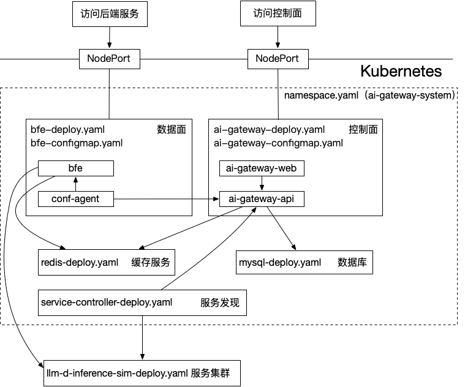

English | [简体中文](./README_CN.md)

# AI Gateway Kubernetes Deployment Example

## Overview



This example demonstrates the interaction of several key components in the `ai-gateway-system` namespace:
- Data plane (bfe with conf-agent): handles traffic forwarding and access control
- Control plane (ai-gateway-api): provides configuration/policy delivery API
- Base dependencies (MySQL, Redis): provide storage and dependency services for the control plane
- Service discovery (service-controller): discovers and syncs backend services
- Demo service (whoami): used to validate routing
- Components communicate via Kubernetes Service/DNS, for example:
  - ai-gateway-api.ai-gateway-system.svc.cluster.local
  - mysql.ai-gateway-system.svc.cluster.local
  - redis.ai-gateway-system.svc.cluster.local

Notes:
- MySQL / Redis use `emptyDir` for storage in this example and data will be lost on Pod restart
- This example is for demo/connectivity validation and is not production-ready

📖 **[Build Guide](./BUILD_GUIDE.md)**: Complete guide from source compilation to Docker image building and Kubernetes deployment

Main files (directory ./kubernetes):

| **File** | **Description** |
|---|---|
| `namespace.yaml` | Namespace definition (ai-gateway-system) |
| `kustomization.yaml` | Kustomize resource aggregation and enable/disable options |
| `bfe-configmap.yaml` | bfe configuration (bfe.conf, conf-agent.toml, etc.) |
| `bfe-deploy.yaml` | bfe data plane Deployment manifest |
| `ai-gateway-configmap.yaml` | ai-gateway-api configuration (DB/Redis connection, auth example) |
| `ai-gateway-deploy.yaml` | ai-gateway-api Deployment/Service manifest |
| `mysql-deploy.yaml` | MySQL Deployment (example database and storage config) |
| `redis-deploy.yaml` | Redis Deployment/Service (example cache config) |
| `service-controller-deploy.yaml` | Service discovery controller Deployment manifest |
| `whoami-deploy.yaml` | whoami demo service Deployment manifest |

## Prerequisites

- kubectl with `-k` support (recommended kubectl >= 1.20)
- kubectl can access the target cluster with permissions to create Namespace, Deployment, Service, ConfigMap, Secret
- Cluster nodes can pull images (configure image acceleration or private registry credentials if needed)

## Quick Start

This README provides only the shortest path to get started. For complete source compilation, image building, and Kubernetes deployment, see:
📖 **[Build Guide](./BUILD_GUIDE.md)**

### 1) Configure Images (Optional)

To replace image addresses or versions, modify `images:` in `kustomization.yaml`:

```yaml
images:
  - name: bfenetworks/bfe
    newName: ghcr.io/your-org/bfe
    newTag: v1.8.0
  - name: ai-gateway-api
    newName: ghcr.io/your-org/ai-gateway-api
    newTag: latest
  - name: bfenetworks/service-controller
    newName: ghcr.io/your-org/service-controller
    newTag: latest
```

### 2) One-Command Deployment

```bash
kubectl apply -k kubernetes 
```

This command deploys: bfe (with conf-agent), ai-gateway-api (with Dashboard), mysql, redis, service-controller.

### 3) Deploy Test Service (Optional)

```bash
kubectl apply -f kubernetes/whoami-deploy.yaml
```

> whoami is deployed in the `default` namespace; to replace the image, edit `whoami-deploy.yaml` directly.

### 4) Quick Validation

```bash
kubectl get pods -n ai-gateway-system
kubectl get svc -n ai-gateway-system
```

Access Dashboard (default username/password: admin/admin):

```
http://{NodeIP}:30183
```

## Common Operations

### Cleanup Deployment

```bash
kubectl delete -f kubernetes/whoami-deploy.yaml
kubectl delete -k kubernetes/
```

> Recommended: delete whoami first, then `ai-gateway-system` to avoid finalizers causing hang.

## Contributing

See [CONTRIBUTING.md](./CONTRIBUTING.md) for how to submit pull requests.

## References

- Build and Deployment Complete Guide: [BUILD_GUIDE.md](./BUILD_GUIDE.md) / [BUILD_GUIDE_CN.md](./BUILD_GUIDE_CN.md)
- BFE Project: https://github.com/bfenetworks/bfe
- AI Gateway API: https://github.com/yf-networks/ai-gateway-api
- Service Controller: https://github.com/bfenetworks/service-controller
- Dashboard Frontend: https://github.com/yf-networks/ai-gateway-web
- Kubernetes Documentation: https://kubernetes.io/docs/